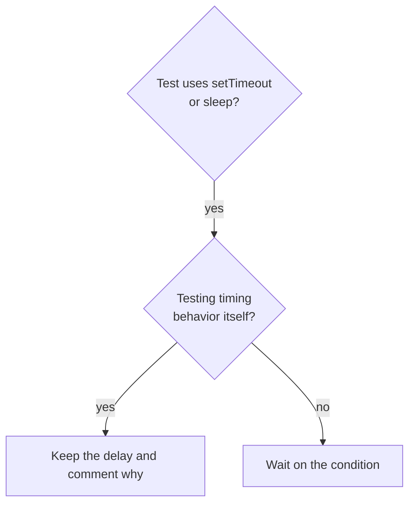

# Condition-Based Waiting

## Overview

Flaky tests often guess at timing with fixed delays. That creates races where tests pass on a fast machine and fail under load or in CI.

**Core principle:** wait for the condition you care about, not a guess about how long it takes.

## When to Use



- Tests have fixed delays (`setTimeout`, `sleep`, `time.sleep()`).
- Tests are flaky: they pass sometimes and fail under load.
- Tests time out when run in parallel.

Don't use it when you are testing timing behavior itself (debounce, throttle intervals); then comment why the delay is what it is.

## Core Pattern

```typescript
// Before: guessing at timing
await new Promise(r => setTimeout(r, 50));
const result = getResult();
expect(result).toBeDefined();

// After: waiting for the condition
await waitFor(() => getResult() !== undefined, 'result');
const result = getResult();
expect(result).toBeDefined();
```

## Quick Patterns

| Scenario | Pattern |
|----------|---------|
| Wait for an event | `waitFor(() => events.find(e => e.type === 'DONE'), 'DONE event')` |
| Wait for a state | `waitFor(() => machine.state === 'ready', 'ready state')` |
| Wait for a count | `waitFor(() => items.length >= 5, '5 items')` |
| Wait for a file | `waitFor(() => fs.existsSync(path), path)` |

## Implementation

```typescript
async function waitFor<T>(
  condition: () => T | undefined | null | false,
  description: string,
  timeoutMs = 5000
): Promise<T> {
  const startTime = Date.now();
  while (true) {
    const result = condition();
    if (result) return result;
    if (Date.now() - startTime > timeoutMs) {
      throw new Error(`Timeout waiting for ${description} after ${timeoutMs}ms`);
    }
    await new Promise(r => setTimeout(r, 10));
  }
}
```

The same shape works in shell: loop on the check with a short sleep and a deadline, and fail with a message naming what you waited for.

## Common Mistakes

- **Polling too fast** (every 1ms) wastes CPU; every 10ms is plenty.
- **No timeout** loops forever if the condition never holds; always fail with a clear message.
- **Stale data:** call the getter inside the loop, not once before it.

## When a Fixed Delay Is Right

```typescript
// Tool ticks every 100ms; we need 2 ticks to see partial output
await waitForEvent(manager, 'TOOL_STARTED'); // first wait for the trigger
await new Promise(r => setTimeout(r, 200));   // then wait for the timed behavior
```

First wait for the triggering condition, base the delay on known timing rather than a guess, and comment why.
