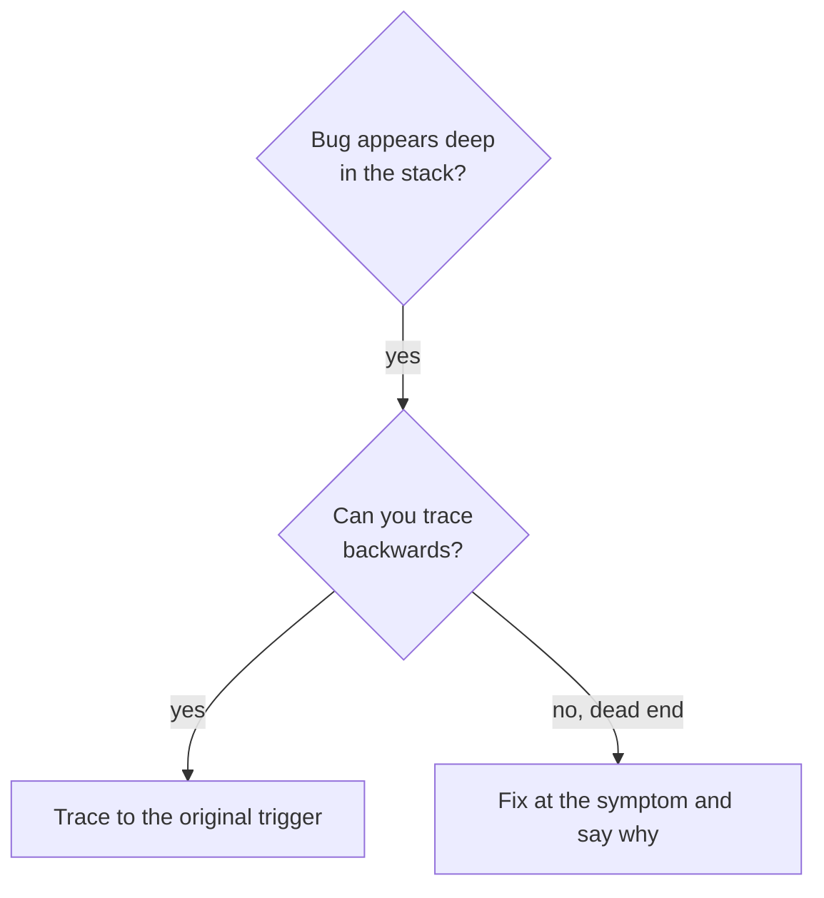
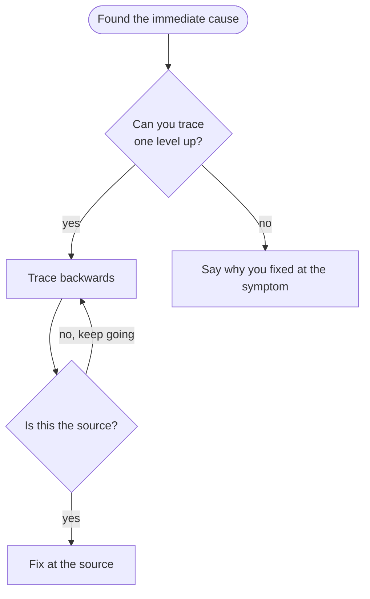

# Root Cause Tracing

## Overview

Bugs often show up deep in the call stack (git init in the wrong directory, a file created in the wrong place, a database opened with the wrong path). The instinct is to fix where the error appears, but that treats a symptom.

**Core principle:** trace backwards through the call chain until you find the original trigger, then fix it at the source.

## When to Use



- The error happens deep in execution, not at the entry point.
- The stack trace shows a long call chain.
- It's unclear where the invalid data came from.
- You need to find which test or code path triggers it.

## The Tracing Process

### 1. Observe the symptom
```
Error: git init failed in ~/project/packages/core
```

### 2. Find the immediate cause
What code directly causes this?
```typescript
await execFileAsync('git', ['init'], { cwd: projectDir });
```

### 3. Ask what called it
```typescript
WorktreeManager.createSessionWorktree(projectDir, sessionId)
  → called by Session.initializeWorkspace()
  → called by Session.create()
  → called by test at Project.create()
```

### 4. Keep tracing up
What value was passed?
- `projectDir = ''` (empty string)
- An empty string as `cwd` resolves to `process.cwd()`
- That's the source code directory.

### 5. Find the original trigger
Where did the empty string come from?
```typescript
const context = setupCoreTest(); // Returns { tempDir: '' }
Project.create('name', context.tempDir); // Accessed before beforeEach
```

## Adding Stack Traces

When you can't trace by reading, instrument the dangerous operation in your disposable reproduction:

```typescript
async function gitInit(directory: string) {
  const stack = new Error().stack;
  console.error('DEBUG git init:', {
    directory,
    cwd: process.cwd(),
    nodeEnv: process.env.NODE_ENV,
    stack,
  });

  await execFileAsync('git', ['init'], { cwd: directory });
}
```

Use `console.error()` in tests, since a logger may be suppressed. Log before the dangerous operation, not after it fails, and include directory, cwd, environment and the stack.

```bash
npm test 2>&1 | grep 'DEBUG git init'
```

Look for test file names, the line that triggers the call, and the pattern (same test, same parameter). Remove the instrumentation once you have the cause.

## Finding Which Test Causes Pollution

If something appears during tests but you don't know which test creates it, run the bisection script in this directory from the repo root of a throwaway clone:

```bash
bash /path/to/find-polluter.sh '.git' 'src/**/*.test.ts'
```

It runs the test files one by one and stops at the first one that creates the path.

## Example: Empty projectDir

**Symptom:** `.git` created in `packages/core/` (source code).

**Trace chain:**
1. `git init` runs in `process.cwd()` because of an empty `cwd` parameter.
2. WorktreeManager was called with an empty projectDir.
3. Session.create() passed an empty string.
4. The test read `context.tempDir` before `beforeEach` ran.
5. `setupCoreTest()` returns `{ tempDir: '' }` initially.

**Root cause:** top-level variable initialization reading a value that isn't set yet.

**Fix:** make `tempDir` a getter that throws if read before `beforeEach`. That fixes the trigger itself; whether any other layer deserves a check is the question in [defense-in-depth.md](defense-in-depth.md).

## Key Principle



Trace back to the original trigger rather than fixing only where the error appears.
