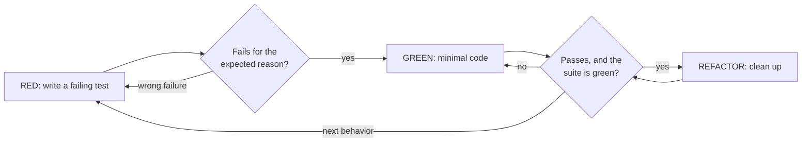

# Test-Driven Development

Adapted from obra/superpowers (MIT) at 8ca22db; see config/pi/superpowers/.

## Overview

Write the test first. Watch it fail. Write the minimal code to pass. Watch it pass.

**Core principle:** If you didn't watch the test fail, you don't know whether it tests the right thing.

## What Gets a Test

A test earns its place by pinning a behavior someone asked for or a failure that happened. AGENTS.md's "Scope" applies to tests like any other code.

- **New project or new feature:** one failing test per behavior the spec or plan asks for, written from its acceptance criteria. The plan's test steps name them; when a spec has no plan, list the behaviors from its acceptance criteria first.
- **Bug fix:** start with a test that reproduces the failure actually seen (the input, the wrong output or the error from the real report or log). It must fail for the same reason the bug did.
- **Behavior change:** change or add the test for the new behavior first, and watch the old code fail it.
- **Not tested:** cases nobody asked for and that haven't happened, "more tests to be safe", trivial code (constants, getters, forwarding), and prose meant for people. Record a case you think matters as a one-line follow-up instead.
- **Needs Court's yes:** stress or fuzz runs, and test code larger than the feature it tests (AGENTS.md: checks cost what they guard).
- **Court checks by looking:** what Court can see (layout, motion, colour, the feel of a TUI) is checked by Court looking at the real thing, not by a test. Give Court the URL or command to see it.
- **Ask Court first:** throwaway prototypes, generated code and configuration files, where a test may cost more than it protects.

## Red, Green, Refactor



Code written before its test is not proven by that test: a test written afterwards passes at once, so you never saw it catch anything. If you wrote code first, set it aside, write the test, watch it fail against the code without your change, then bring the change back. Exploration is fine; start the real change from a test.

### RED: write the failing test

Write one minimal test showing what should happen.

```typescript
// Good: clear name, real behavior, one thing
test('retries failed operations 3 times', async () => {
  let attempts = 0;
  const operation = () => {
    attempts++;
    if (attempts < 3) throw new Error('fail');
    return 'success';
  };

  const result = await retryOperation(operation);

  expect(result).toBe('success');
  expect(attempts).toBe(3);
});
```

```typescript
// Bad: vague name, tests the mock, not the code
test('retry works', async () => {
  const mock = jest.fn()
    .mockRejectedValueOnce(new Error())
    .mockRejectedValueOnce(new Error())
    .mockResolvedValueOnce('success');
  await retryOperation(mock);
  expect(mock).toHaveBeenCalledTimes(3);
});
```

One behavior, a name that says what it is, real code (mocks only where the real dependency is slow or external).

### Verify RED: watch it fail

Run it and read the output. This step is the only proof the test can catch anything.

```bash
npm test path/to/test.test.ts
```

- It fails, rather than erroring.
- The failure message is the one you expect.
- It fails because the behavior is missing, not because of a typo.

If it passes, it is testing behavior that already exists: fix the test. If it errors, fix the error and re-run until it fails for the right reason.

### GREEN: minimal code

Write the simplest code that passes the test.

```typescript
// Good: just enough to pass
async function retryOperation<T>(fn: () => Promise<T>): Promise<T> {
  for (let i = 0; i < 3; i++) {
    try {
      return await fn();
    } catch (e) {
      if (i === 2) throw e;
    }
  }
  throw new Error('unreachable');
}
```

```typescript
// Bad: options nobody asked for
async function retryOperation<T>(
  fn: () => Promise<T>,
  options?: { maxRetries?: number; backoff?: 'linear' | 'exponential'; onRetry?: (n: number) => void }
): Promise<T> { /* ... */ }
```

Don't add features, refactor other code, or "improve" beyond the test.

### Verify GREEN: watch it pass

Run the test, then the project's whole suite (bare `pytest`, `npm test`, `cargo test`, whatever the repo or its CI uses), even when the task named only one test file. A task's scope bounds the deliverable, not the verification.

- The test passes and the rest of the suite still passes.
- The output is clean (no new errors or warnings).
- If the test fails, fix the code, not the test.
- Any failure in the suite, including one you didn't cause, goes in your report by name.

The verdict is the exit code, not piped or summarized output (AGENTS.md "Verifying").

### REFACTOR: clean up

Only once green: remove duplication, improve names, extract helpers. Keep the tests green and don't add behavior.

### Repeat

Next failing test for the next behavior the spec or plan asks for. When those are done, the task is done.

## Good Tests

| Quality | Good | Bad |
|---------|------|-----|
| **Minimal** | One thing. "and" in the name? Split it. | `test('validates email and domain and whitespace')` |
| **Clear** | The name describes the behavior | `test('test1')` |
| **Shows intent** | Demonstrates the API you want | Obscures what the code should do |

When writing or changing a test, adding a mock, or adding test-only helpers, read [writing-good-tests.md](writing-good-tests.md): name the break the test catches, assert on real behavior, keep test-only code out of production classes.

## Example: Bug Fix

**Bug seen:** a form with an empty email was accepted (the report shows the saved record with `email: ""`).

**RED**
```typescript
test('rejects empty email', async () => {
  const result = await submitForm({ email: '' });
  expect(result.error).toBe('Email required');
});
```

**Verify RED**
```bash
$ npm test
FAIL: expected 'Email required', got undefined
```

**GREEN**
```typescript
function submitForm(data: FormData) {
  if (!data.email?.trim()) {
    return { error: 'Email required' };
  }
  // ...
}
```

**Verify GREEN**
```bash
$ npm test
PASS
```

The reported case is pinned. A whitespace-only email, a malformed one, a missing domain: none were reported, so they are follow-ups, not tests.

## Common Rationalizations

| Excuse | Reality |
|--------|---------|
| "Too simple to watch fail" | Watching it fail is one command. Run it. |
| "I'll test after" | A test written after passes at once, which proves nothing about whether it can catch the bug. |
| "Already manually tested" | There is no record of what was covered and no way to re-run it. Write the test for the behavior that was asked for. |
| "More tests to be safe" | Every test costs maintenance. Test what the spec asks for and what has happened; the rest is a follow-up. |
| "This edge case could happen" | Name when it happened in real use. If you can't, it is a follow-up line. |
| "A quick fuzz run would be thorough" | Stress and fuzz runs need Court's yes. |
| "The test is hard to write" | Hard to test usually means hard to use. Simplify the interface. |
| "I can test the layout with a snapshot" | What Court can see, Court checks by looking. |

## Verification Checklist

Before calling the work done:

- [ ] Each behavior the spec or plan asks for has a test, and each reported bug has a test reproducing it.
- [ ] You watched each test fail for the expected reason before implementing.
- [ ] You wrote minimal code to pass each test.
- [ ] The whole suite passes by its exit code, with clean output.
- [ ] Tests use real code (mocks only where the real dependency is slow or external).
- [ ] No tests for cases nobody asked for; those are follow-up lines.
- [ ] Anything Court can see has been put in front of Court to look at.

## When Stuck

| Problem | Solution |
|---------|----------|
| Don't know how to test it | Write the API you wish existed and the assertion first. If still unclear, ask Court one question. |
| Test too complicated | The design is too complicated. Simplify the interface. |
| Must mock everything | The code is too coupled. Pass the dependency in. |
| Test setup is huge | Extract helpers. Still complex? Simplify the design. |

For a bug whose cause you don't yet know, use the systematic-debugging skill to find the root cause first; its fix starts with the reproducing test from this skill.
